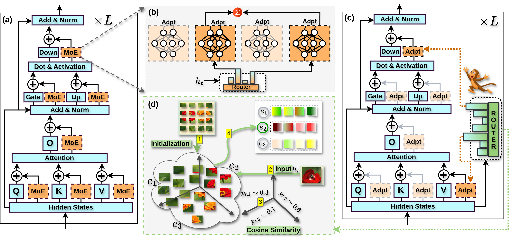

<p align="center">
  
</p>

<h1 align="center"> Monkey Jump : MoE-Style PEFT for Efficient Multi-Task Learning</h1>
<p align="center">
  <a href="#" target="_blank">
    
  </a>
  &nbsp;&nbsp;&nbsp;&nbsp;
  <a href="https://github.com/Nusrat-Prottasha/MonkeyJump" target="_blank">
    
  </a>
  &nbsp;&nbsp;&nbsp;&nbsp;
  <a href="#" target="_blank">
    
  </a>
</p>

---
<p align="center">
  
</p>
## 🔷 Overview

Monkey Jump (MJ) achieves **MoE-style specialization** in parameter-efficient fine-tuning (PEFT) without adding trainable parameters. It treats existing PEFT adapters as **implicit experts** and routes tokens among them using **gradient-free k-means clustering** with **EMA-updated centers**.

### 🎯 Key Innovation
> **Zero routing parameters** — Unlike traditional MoE-PEFT methods that require separate routing networks, Monkey Jump uses k-means clustering to dynamically assign tokens to experts, achieving specialization with zero routing overhead.

---

## ✨ Key Features

- 🎯 **Zero additional trainable parameters** for routing
- 📉 **7–29× fewer parameters** than MoE-PEFT methods
- 💾 **Up to 48% lower peak GPU memory** usage
- ⚡ **1.5–2× faster** training and inference
- 🔧 Supports multiple PEFT variants: **LoRA, LoRA-FA, AdaLoRA, Propulsion**
- 🎲 Token-wise and sentence-wise routing modes

<p align="center">
  
</p>

---
## 🔧 Requirements

### Software Dependencies

| Package | Version |
|---------|---------|
| Python | ≥ 3.10 |
| PyTorch | ≥ 2.1.0 |
| transformers | ≥ 4.50.0 |
| accelerate | ≥ 0.27.0 |
| datasets | ≥ 2.18.0 |
| peft | ≥ 0.10.0 |
| scikit-learn | ≥ 1.4.0 |
| LaTeX | For paper compilation |

### Hardware

All experiments were conducted on **NVIDIA H100 80GB GPUs** with CUDA 12.1+.

---

## ⚙️ Installation
```bash
git clone https://github.com/yourusername/MonkeyJump.git
cd MonkeyJump
pip install torch torchvision torchaudio
pip install transformers accelerate datasets peft
pip install scikit-learn tqdm numpy pandas
```

---

## 🚀 Usage

### Step 1: Apply MonkeyJump to Your Model
```python
from transformers import AutoModelForCausalLM
from src.MJLoRA import apply_monkeyjump

# Load your base model
model = AutoModelForCausalLM.from_pretrained("model_name")

# Apply MonkeyJump
model = apply_monkeyjump(
    model,
    blocks={"LlamaDecoderLayer": list(range(32))},
    linears=["q_proj", "k_proj", "v_proj", "o_proj"],
    shared_expert=["up_proj", "down_proj"],
    rank=2,
    alpha=16.0,
    temperature=1.0,
    ema_momentum=0.2,
    top_k=2,
    rep_mode="token",
)
```

### Step 2: Initialize Router Centers
```python
from src.kmneas import init_router_centers

init_router_centers(
    trainer,
    subset_size=4000,
    kmeans_iters=15,
    rep_mode="token",
)
```

### Step 3: Train with MonkeyTrainer
```python
from src.MJtrainer import MonkeyTrainer

trainer = MonkeyTrainer(
    model=model,
    args=training_args,
    train_dataset=train_dataset,
    step_interval=2,
    stop_update_step=3000,
)
trainer.train()
```

---

## 📊 Configuration Parameters

### MonkeyJump-LoRA Parameters

| Parameter | Description | Default |
|-----------|-------------|---------|
| `rank` | LoRA rank | 2 |
| `alpha` | LoRA scaling factor | 16.0 |
| `temperature` | Router softmax temperature | 1.0 |
| `ema_momentum` | EMA momentum for center updates | 0.9 |
| `top_k` | Number of experts to activate | 2 |
| `rep_mode` | Routing mode: token, last, mean | token |
| `jitter_noise` | Exploration noise (training) | 0.1 |

### Routing Modes

| Mode | Description | Output Shape |
|------|-------------|--------------|
| `token` | Per-token routing (default) | [B, T, k] |
| `last` | Last token representation | [B, k] |
| `mean` | Mean pooled representation | [B, k] |
| `prompt_end` | Token at prompt boundary | [B, k] |

---

## 🧩 Core Components

### 1️⃣ MonkeyJumpLinear (MJLoRA.py)

Main implementation containing:
- **MonkeyJumpLinear**: LoRA adapter with routing mask
- **MonkeyJumpRouter**: Cosine-similarity router with EMA centers
- **apply_monkeyjump()**: Function to apply MJ to a model

### 2️⃣ K-means Initialization (kmneas.py)

Utilities for initializing router centers via k-means++ with cosine similarity.

**Key functions:**
- `kmeans_pp_cosine()`: K-means++ initialization with cosine distance
- `collect_representations()`: Collect hidden representations from data
- `init_router_centers()`: Initialize all router centers in the model

### 3️⃣ MonkeyTrainer (MJtrainer.py)

Custom HuggingFace Trainer with:
- ✅ Scheduled EMA center updates
- ✅ Configurable update intervals
- ✅ Automatic stopping of updates after N steps

---

## 📈 Performance & Efficiency

<p align="center">
  
</p>

### Key Metrics

| Metric | Improvement vs MoE-PEFT |
|--------|-------------------------|
| **Trainable Parameters** | 7-29× fewer |
| **Peak GPU Memory** | Up to 48% lower |
| **Training Speed** | 1.5-2× faster |
| **Inference Speed** | 1.5-2× faster |

---

## 🎯 Tips & Best Practices

### Getting Started
- Start with **`rank=2`** and **`top_k=2`** for most tasks
- Use **token-wise routing** (`rep_mode="token"`) as default
- Initialize with **4000-8000 samples** for stable clustering

### Optimization Strategies

#### 🔸 Reduce Memory Usage
- Lower `top_k` (fewer active experts)
- Use sentence-wise routing (`rep_mode="mean"` or `"last"`)
- Reduce `rank` if model is overfitting

#### 🔸 Improve Accuracy
- Increase `rank` (4-8 for complex tasks)
- Increase `top_k` (3-4 for better coverage)
- Use more k-means iterations during initialization

#### 🔸 Speed Up Training
- Stop EMA updates earlier (`stop_update_step=2000`)
- Use larger `step_interval` for EMA updates
- Reduce `subset_size` during initialization

### Hyperparameter Tuning Guide

| Issue | Solution |
|-------|----------|
| Underfitting | Increase `rank`, `top_k`, or `alpha` |
| Overfitting | Decrease `rank`, add regularization |
| Unstable training | Increase `ema_momentum`, lower learning rate |
| Routing too sharp | Increase `temperature` (e.g., 1.5-2.0) |
| Routing too soft | Decrease `temperature` (e.g., 0.5-0.8) |

---

## 📚 Citation

If you use Monkey Jump in your research, please cite our paper:
```bibtex
@article{monkeyjump2024,
  title={Monkey Jump: MoE-Style Specialization for Parameter-Efficient Fine-Tuning},
  author={Your Name and Co-authors},
  journal={arXiv preprint arXiv:XXXX.XXXXX},
  year={2024}
}
```

**Under Review at [Conference Name] 2025**

---

## 🤝 Contributing

We welcome contributions! Here's how you can help:

- 🐛 Report bugs via [GitHub Issues](https://github.com/yourusername/MonkeyJump/issues)
- 💡 Suggest features or improvements
- 📝 Improve documentation
- 🔧 Submit pull requests

Please see [CONTRIBUTING.md](CONTRIBUTING.md) for detailed guidelines.

---

## 📝 License

Monkey Jump is licensed under the MIT License. See [LICENSE](LICENSE) file for details.

---

## 📧 Contact

- **Issues**: [GitHub Issues](https://github.com/yourusername/MonkeyJump/issues)
- **Email**: your.email@institution.edu
- **Project Website**: [Coming Soon](#)

---

## 🙏 Acknowledgments

- Built on top of [PEFT](https://github.com/huggingface/peft) and [Transformers](https://github.com/huggingface/transformers)
- Inspired by recent advances in MoE and parameter-efficient fine-tuning
- Thanks to all contributors and the open-source community

---

© 2024 Your Institution | Monkey Jump | MoE-PEFT without Routing Parameters
# Navigate to your repository
cd /path/to/MonkeyJump

# Create README.md (then paste the content)
nano README.md
# or
vim README.md
