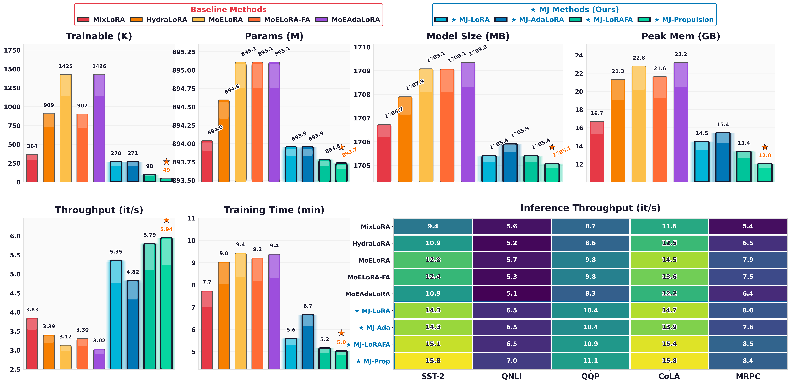

<p align="center">  </p> <h1 align="center"> Monkey Jump : MoE-Style PEFT for Efficient Multi-Task Learning</h1> <p align="center"> <a href="#" target="_blank">  </a> &nbsp;&nbsp;&nbsp;&nbsp; <a href="https://github.com/Nusrat-Prottasha/MonkeyJump" target="_blank">  </a> &nbsp;&nbsp;&nbsp;&nbsp; <a href="#" target="_blank">  </a> </p>
<p align="center">  </p>
---

## 🧠 Abstract

Mixture-of-experts (MoE) variants of parameter-efficient fine-tuning (PEFT) enable per-token specialization, but they introduce **additional trainable routers and expert parameters**, increasing memory and training costs. This undermines the core goal of **parameter-efficient fine-tuning**.

We propose **Monkey Jump (MJ)** — named for the selective activation pattern: adapters *"jump"* on for some projections and off for others.

MJ brings MoE-style specialization to PEFT **without adding extra trainable parameters** for experts or routers. Instead of introducing new adapter experts, MJ reuses the **PEFT adapters already present** in each Transformer block (e.g., query, key, value, up, and down projections) as **implicit experts**, and routes tokens among them using:

- 🔍 **$k$-means clustering** with **EMA-updated centers**
- ❌ **No gradients, no learned parameters**

### 📐 Theory Insight

We theoretically show that **token-wise routing increases expressivity**, outperforming shared adapters by **avoiding cancellation effects**.

### 🧪 Experimental Results

In multi-task benchmarks:
- 📝 **14 Text**, 🖼️ **14 Image**, 🎬 **19 Video** datasets
- MJ matches or outperforms MoE-PEFT methods while using:
  - **7–29× fewer trainable parameters**
  - **Up to 48% lower GPU memory**
  - **1.5–2× faster training**

> 🧩 Monkey Jump is **architecture-agnostic** and can be applied to any adapter-based PEFT method.
---


---

## 🚀 Features

- 🔀 MoE-style routing without any trainable parameters
- 🧠 Token-wise and sentence-wise clustering-based routing
- ⚡ 1.5–2× faster training and inference
- 💾 Up to 48% GPU memory savings
- 🔧 Compatible with LoRA, AdaLoRA, LoRA-FA, Propulsion
- 🧪 Gradient-free token routing via $k$-means + EMA

---

## ⚙️ Installation

```bash
git clone https://github.com/yourusername/MonkeyJump.git
cd MonkeyJump
pip install torch torchvision torchaudio
pip install transformers accelerate datasets peft
pip install scikit-learn tqdm numpy pandas
```

---

## 💻 Quick Start

```python
from transformers import AutoModelForCausalLM
from src.MJLoRA import apply_monkeyjump

model = AutoModelForCausalLM.from_pretrained("model_name")
model = apply_monkeyjump(
    model,
    blocks={"LlamaDecoderLayer": list(range(32))},
    linears=["q_proj", "k_proj", "v_proj", "o_proj"],
    shared_expert=["up_proj", "down_proj"],
    rank=2,
    alpha=16.0,
    temperature=1.0,
    ema_momentum=0.2,
    top_k=2,
    rep_mode="token",
)
```

### Initialize Router

```python
from src.kmneas import init_router_centers

init_router_centers(
    trainer,
    subset_size=4000,
    kmeans_iters=15,
    rep_mode="token",
)
```

---

## 🧪 Routing Modes

| Mode        | Description               |
|-------------|----------------------------|
| `token`     | Per-token routing          |
| `last`      | Uses last token only       |
| `mean`      | Mean of all tokens         |
| `prompt_end`| Token at prompt boundary   |

---

### 📈 Efficiency Analysis

<p align="center">
  
</p>

Monkey Jump (MJ) is designed to deliver **MoE-style specialization** without compromising the efficiency that PEFT methods are known for. To evaluate this, we use the `LLaVA-OneVision-Qwen2-0.5B` backbone with `rank=2`, applying MoE-style PEFT to attention projections (Q, K, V, O).

All methods are benchmarked under the **same environment** for fairness:

- **GPU**: NVIDIA H100 80GB  
- **Framework**: PyTorch + HuggingFace Transformers  
- **Batch Size**: 8  
- **Gradient Accumulation**: 2  

The figure above compares **MJ variants** and **MoE-PEFT baselines** across 6 key metrics.

---

### 🔢 Parameter Efficiency

MJ uses **significantly fewer trainable parameters**:

| Method         | Params (K) |
|----------------|------------|
| MJ-Propulsion  | **49**     |
| MixLoRA        | 364        |
| HydraLoRA      | 909        |
| MoELoRA        | 1,425      |
| MJ-LoRAFA      | 98         |
| MJ-LoRA        | 270        |

> 🔍 *Despite the lower trainable parameter count, the total model size remains nearly identical (~1,705MB), as MJ reuses existing adapters instead of adding new experts.*

---

### 💾 Memory Efficiency

MJ significantly reduces peak GPU memory usage:

| Method         | Peak Memory (GB) |
|----------------|------------------|
| MJ-Propulsion  | **12.0**         |
| MoEAdaLoRA     | 23.2             |
| MoELoRA        | 22.8             |
| MJ-AdaLoRA     | 15.4             |

> 💡 *MJ achieves memory savings of up to **48%**, thanks to top-k sparse routing that activates fewer branches per pass.*

---

### ⚡ Training Speed

MJ improves training throughput and duration:

| Method         | It/s | Train Time (min) |
|----------------|------|------------------|
| MJ-Propulsion  | **5.94** | **5.0**         |
| MoE-PEFT Avg.  | 3.02–3.83 | 7.7–9.4        |

> 🚀 *All MJ variants exceed 4.8 it/s, while no MoE-PEFT method exceeds 3.9 it/s.*

---

### 🧠 Inference Speed

MJ maintains high throughput during inference:

- MJ-Propulsion achieves **15.8 it/s** on SST-2
- MoE-PEFT ranges from **9.4 to 12.8 it/s**

> 📌 *On average, MJ variants achieve **10–25% higher** inference throughput.*
>
> 
## 🔬 Theoretical Insights

Monkey Jump (MJ) is not only parameter-efficient—it’s also grounded in solid theoretical guarantees. Below are two key results explaining why MJ works better than standard PEFT and MoE-PEFT variants.

---

### 📈 1. Token-wise Routing Increases Expressivity

In standard PEFT, all adapters are applied uniformly to all tokens. The aggregate update has limited expressivity due to cancellation effects:

```math
U^{\text{PEFT}} = \left( \sum_{e=1}^{E} \Delta W_e \right) H
```

This summed update may have lower rank than the union of all adapter subspaces.

In contrast, MJ routes tokens selectively:

```math
U^{\text{MJ}} = \left[ \Delta W_1 H_1 \; \cdots \; \Delta W_E H_E \right]
```

Where \( H_e \) contains the tokens routed to adapter \( e \). This increases the span of outputs:

```math
\mathrm{rank}(U^{\text{MJ}}) \geq \mathrm{rank}(U^{\text{PEFT}})
```

> ✅ **Key Insight**: By avoiding overlap and cancellation, MJ preserves the diversity of adapter transformations.

---

### 🧠 2. Last-Token Routing is Information-Theoretically Optimal

When performing sequence-wise routing, we need a single representation to determine adapter routing.

In causal Transformers, the **last token representation** \( h_T \) is optimal because it has attended to the entire input sequence:

```math
I(h_T; X) \geq I(h_t; X) \quad \forall t < T
```

```math
I(h_T; X) \geq I(\bar{h}; X), \quad \text{where } \bar{h} = \frac{1}{T} \sum_{t=1}^T h_t
```
---

These results show that MJ delivers both **efficient** and **expressive** token adaptation, grounded in provable design choices.


## 🧪 Experiments

We evaluate **Monkey Jump (MJ)** on 47 multi-task benchmarks across three modalities:

- 📝 **Text**: 14 tasks (98K samples)  
- 🖼️ **Image**: 14 tasks (42K samples)  
- 🎬 **Video**: 19 tasks (13K samples)

### ⚙️ Setup

- **Text tasks** use *LLaMA-3-8B-Instruct*.
- **Image/Video tasks** use *LLaVA-OneVision-Qwen2-7B*.
- All methods apply PEFT or MoE-PEFT to attention projections (Q, K, V, O) and FFN gate.
- MJ variants tested: `MJLoRA`, `MJLoRAFA`, `MJAdaLoRA`, and `MJPropulsion`.

> For ablations, we use `Qwen2-0.5B` and restrict PEFT to attention projections only.  
> Hyperparameters, model configurations, and dataset details are in the appendix.

### 📊 Overall Results

<p align="center">
  
</p>

Table: Average performance across task families (mean ± std over 5 runs).  
Columns: **GLUE**, **Commonsense & QA**, **Image Classification**, **Vision–Language QA**,  
**Action & Object Reasoning**, **Motion**, and **High-Level Reasoning**.

### 🔍 Key Takeaways

- ✅ **MJ achieves comparable or better performance** than MoE-PEFT methods with **7–29× fewer parameters**
- 🏆 **MJLoRA ties or outperforms** HydraLoRA and MoA on GLUE and QA tasks
- 🖼️ **MJAdaLoRA** leads image classification and action-object tasks
- ⚡ **MJPropulsion** shines in motion understanding and high-level video reasoning

Despite being **router-free and gradient-free**, MJ achieves specialization through content-aware routing—backed by both theory and experiment.

## 🧪 Ablation Study: Layer-wise Cluster Visualization

<p align="center">
  
</p>

To better understand how Monkey Jump routes tokens at different depths, we visualize token clusters across all 24 layers of a Transformer. Each subplot shows the 2D t-SNE projection of token representations, colored by assigned expert (E0–E4). Cluster centers (routing centroids) are marked with stars.

### 🔍 Key Takeaways:
- Early layers show overlapping clusters — indicating general shared token features.
- Mid layers (6–15) develop clearly **separated clusters** — reflecting token specialization.
- Late layers exhibit both tight and diffuse clusters — suggesting a mix of specialized and general processing.
- Routing centroids consistently stay near cluster centers, showing stable adaptation from k-means and EMA.

> 🧪 **Note**: This is just one of several ablation studies we present in our paper.
For further insights (e.g., initialization, routing sparsity, adapter sharing), please refer to the full paper.

## 📜 Citation

```bibtex
@article{prottasha2025monkeyjump,
  title={MoE-Style PEFT for Efficient Multi-Task Learning},
  author={Prottasha, Nusrat Jahan and Kowsher, Md and Yu, Chun-Nam and Chen, Chen and Garibay, Ozlem},
  journal={arXiv preprint arXiv:2501.xxxxx},
  year={2025}
}
```
---

## 📝 License

MIT License

---


